# Step 01: Deploy Your First AI Agents

## What You'll Learn

In this step, you will:
- Deploy AI agents on Kubernetes using the Agent Runtime Operator
- Understand Agent-to-Agent (A2A) communication patterns
- Learn about Model Context Protocol (MCP) for tool integration
- Set up observability for AI workflows

## What You'll Build

By the end of this step, you will have deployed:
- **Agent Runtime Operator**: Manages the lifecycle of AI agents
- **News Agent**: Fetches news articles and coordinates summarization
- **Summarizer Agent**: Extracts and summarizes article content
- **News Fetcher MCP Server**: Provides RSS feed aggregation tools
- **LGTM Observability Stack**: Logs, metrics, and traces
- **Observability Dashboard**: Real-time visualization of agent interactions

## Prerequisites

Before starting this step, ensure you have:
- Completed Step 00 (vcluster access and platform setup)
- kubectl configured to access your vcluster
- The following tools installed: `kubectl`, `curl`, `jq`

Verify your access:
```bash
kubectl get nodes
```

---

## Understanding the Building Blocks

### What is the Agent Runtime Operator?

The Agent Runtime Operator is a Kubernetes operator that manages AI agents as native Kubernetes resources. Instead of manually deploying containers and configuring services, you define agents declaratively using Custom Resource Definitions (CRDs), and the operator handles the deployment, scaling, and lifecycle management.

### Key Concepts

- **Agent**: An AI-powered service that can reason, make decisions, and take actions using LLMs
- **MCP (Model Context Protocol)**: A standard protocol for connecting tools and data sources to agents
- **A2A Protocol**: Agent-to-Agent communication protocol that allows agents to delegate tasks to other agents
- **ToolServer**: A service that exposes tools to agents via the MCP protocol
- **Operator Pattern**: A Kubernetes pattern for managing complex applications using custom controllers

---

## Installation Steps

### Step 1: Install cert-manager

The Agent Runtime Operator uses webhooks for validating and mutating agent resources. cert-manager provides automatic certificate management for these webhooks.

Install cert-manager:
```bash
curl -L https://github.com/cert-manager/cert-manager/releases/download/v1.19.1/cert-manager.yaml | kubectl apply -f -
```

Wait for cert-manager to be ready:
```bash
kubectl wait --for=condition=Ready pods --all -n cert-manager --timeout=60s
```

### Step 2: Install Agent Runtime Operator

The Agent Runtime Operator extends Kubernetes with three new resource types:
- `Agent`: Defines an AI agent deployment
- `ToolServer`: Defines an MCP tool server
- `AgentGateway`: Defines routing and access for agents

Install the operator:
```bash
curl -L https://github.com/agentic-layer/agent-runtime-operator/releases/download/v0.9.0/install.yaml | kubectl apply -f -
```

Wait for the operator to be ready:
```bash
kubectl wait --for=condition=Available --timeout=60s -n agent-runtime-operator-system deployment/agent-runtime-operator-controller-manager
```

Verify the CRDs are installed:
```bash
kubectl get crd | grep agentic-layer.ai
```

You should see:
```
agentgatewayclasses.runtime.agentic-layer.ai
agentgateways.runtime.agentic-layer.ai
agenticworkforces.runtime.agentic-layer.ai
agents.runtime.agentic-layer.ai
aigatewayclasses.runtime.agentic-layer.ai
aigateways.runtime.agentic-layer.ai
toolservers.runtime.agentic-layer.ai
```

### Step 3: Deploy the News Showcase

Deploy the news agent showcase application:
```bash
kubectl apply -k steps/01-agentic-layer-runtime/showcase-news
```

If you get an error like `failed calling webhook`, keep trying.

This creates:
- A namespace `showcase-news`
- A News Agent that coordinates news retrieval and summarization
- A Summarizer Agent that extracts article content
- A News Fetcher MCP ToolServer that aggregates RSS feeds

Check that all components are running:
```bash
kubectl get pods -n showcase-news
```

Expected output:
```
NAME                                READY   STATUS    RESTARTS   AGE
news-agent-68bfc8b644-67cqh         1/1     Running   0          78s
news-fetcher-78545466d7-c2xth       1/1     Running   0          76s
summarizer-agent-5b97955cfd-4gt2d   1/1     Running   0          75s
```

Inspect the agent definitions:
```bash
kubectl get agents -n showcase-news
```

### Step 4: Deploy Observability Stack

Deploy the LGTM monitoring stack (Loki, Grafana, Tempo, Mimir):
```bash
kubectl apply -k steps/01-agentic-layer-runtime/monitoring/
```

Wait for the LGTM deployment to be ready:
```bash
kubectl wait --for=condition=Available --timeout=120s -n monitoring deployment/lgtm
```

The monitoring stack provides:
- **Grafana**: Dashboards and visualization (port 3000)
- **OpenTelemetry Collector**: Trace collection (ports 4317/4318)
- **Loki**: Log aggregation
- **Tempo**: Distributed tracing
- **Mimir**: Metrics storage

Deploy the Agentic Layer observability dashboard:
```bash
kubectl apply -k steps/01-agentic-layer-runtime/agentic-layer/
```

The observability dashboard:
- Visualizes agent-to-agent communication in real-time
- Provides debugging capabilities for AI workflows
- Exposes metrics about agent performance

### Step 5: Set Up Access

Set up individual port forwarding to access the services locally:
```bash
kubectl port-forward -n showcase-news service/news-agent 8001:8000 &
kubectl port-forward -n showcase-news service/summarizer-agent 8002:8000 &
kubectl port-forward -n showcase-news service/news-fetcher 8003:8000 &
kubectl port-forward -n observability-dashboard service/observability-dashboard 8100:8000 &
kubectl port-forward -n monitoring service/lgtm 3000:3000 &
```

**Note**: The `&` runs each command in the background. Keep the terminal open to maintain the port forwards.

You can now access:
- Observability Dashboard: http://localhost:8100
- Grafana: http://localhost:3000
- News Agent API: http://localhost:8001
- Summarizer Agent API: http://localhost:8002
- News Fetcher MCP Server: http://localhost:8003

---

## Test the Agents

Before running these tests, open the [Observability Dashboard](http://localhost:8100/) in your browser to watch the agent interactions in real-time.

This test demonstrates the full workflow: the News Agent fetches recent articles using the MCP tool, then delegates summarization to the Summarizer Agent.


Watch the Observability Dashboard to see the News Agent calling the Summarizer Agent. Click on the agents to see details of their requests/responses.

### Directly via A2A

You can query the news-agent directly with a simple A2A query. This connection is only possible because we directly expose the agent.

```bash
curl http://localhost:8001/ \
  -H "Content-Type: application/json" \
  -d '{
    "jsonrpc": "2.0",
    "id": 1,
    "method": "message/send",
    "params": {
      "message": {
        "role": "user",
        "parts": [
          {
            "kind": "text",
            "text": "Whats the latest news in AI? Summarize the top article to me."
          }
        ],
        "messageId": "9229e770-767c-417b-a0b0-f0741243c579",
        "contextId": "abcd1234-5678-90ab-cdef-1234567890a0"
      },
      "metadata": {}
    }
  }' | jq
```

Next, try querying the summarizer-agent directly.

---

## Understanding the Architecture

The following diagram shows how the components interact:

```mermaid
graph LR
    User["👤 User"]
    NewsAgent["📰 News Agent"]
    SummarizerAgent["📝 Summarizer Agent"]
    MCPServer["🔧 News MCP Server"]

    User -->|'1. What's new in AI?'|NewsAgent
    NewsAgent -->|2 . Tool Call:<br>Fetch Articles|MCPServer
    MCPServer -->|3 . fetch|RSSFeeds["📡 RSS Feeds"]
    User -->|'4 . Summarize the first article'|NewsAgent
    NewsAgent -->|5 . Agent Task:<br>Summarize URL|SummarizerAgent
    SummarizerAgent -->|6. Tool Call:<br>Fetch Articles|MCPServer
    MCPServer -->|7 . GET|Internet["🌐 Internet"]

%% Styling
    classDef userClass fill: #e1f5fe
    classDef agentClass fill: #f3e5f5
    classDef mcpClass fill: #e8f5e8
    classDef externalClass fill: #fff3e0

    class User userClass
    class NewsAgent agentClass
    class SummarizerAgent agentClass
    class MCPServer mcpClass
    class Internet externalClass
    class RSSFeeds externalClass
```



### The Request Flow

1. **User Request**: The user sends a natural language request to the News Agent
2. **Tool Invocation**: The News Agent uses the MCP protocol to call tools on the News Fetcher server to retrieve recent articles
3. **Data Retrieval**: The News Fetcher aggregates articles from multiple RSS feeds
4. **Agent Delegation**: The News Agent delegates the summarization task to the Summarizer Agent using the A2A protocol
5. **Content Extraction**: The Summarizer Agent uses MCP tools to fetch and parse the article content
6. **Response**: The summary flows back through the agent chain to the user

### Communication Protocols

- **A2A (Agent-to-Agent)**: Used for agent-to-agent communication. Agents can discover and invoke other agents.
- **MCP (Model Context Protocol)**: Used for tool integration. Agents discover and invoke tools provided by ToolServers.
- **OpenTelemetry**: All interactions are instrumented with traces that flow to the observability stack.

---

## Hands-On Exploration

Try these tasks to deepen your understanding:

### Inspect Agent Definitions

View the full configuration of the [News Agent](showcase-news/news-agent.yaml)

Notice the following sections:
- `spec.description`: Explains the agent's purpose
- `spec.instruction`: The system prompt that defines the agent's behavior
- `spec.model`: The LLM model being used (gemini-2.5-flash)
- `spec.subAgents`: References other agents (the Summarizer)
- `spec.tools`: References to MCP ToolServers
- `spec.protocols`: Supported communication protocols (A2A)

### Explore the MCP ToolServer

View the ToolServer definition:
```bash
kubectl get toolserver news-fetcher -n showcase-news -o yaml
```

### Monitor Agent Activity

Watch the agent logs in real-time:
```bash
kubectl logs -f -n showcase-news deployment/news-agent
```

### Explore Traces in Grafana

1. Open [Grafana](http://localhost:3000/a/grafana-exploretraces-app/explore?actionView=traceList)
2. Navigate to the Traces view
3. Find the trace for your request
4. Examine the spans to see each step of the workflow

> [!TIP]
> Try modifying the News Agent's system prompt to change its behavior. Edit the agent's `spec.instruction` field ask it to respond in a different style (e.g., more concise, in a specific language, or with a particular focus), then re-apply the manifest. Observe how the agent's behavior changes.

---

## What's Next?

In **Step 02: Agent Gateway and Frontend**, you will:
- Deploy an Agent Gateway to provide OpenAI-compatible APIs
- Enable external access to your agents via ingress
- Add service discovery and routing capabilities
- Implement authentication and rate limiting

Currently, your agents are only accessible via port-forwarding. The Agent Gateway will expose them properly and provide a standardized interface for client applications.
